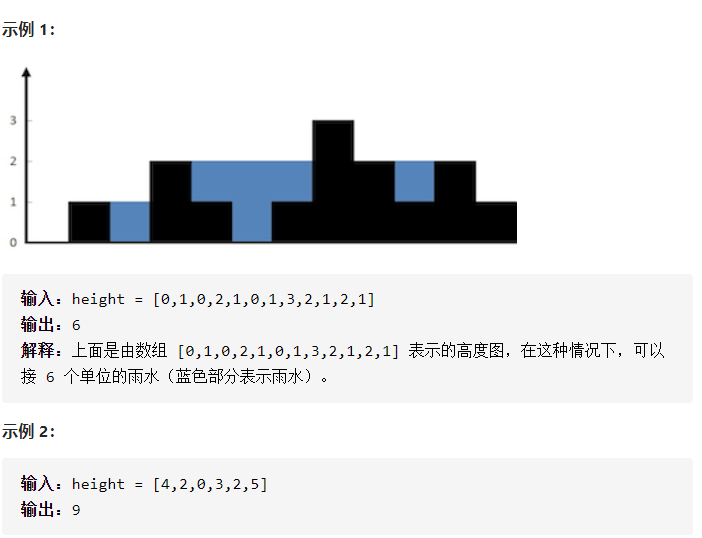

# .42接雨水

### 题目描述
```
给定 n 个非负整数表示每个宽度为 1 的柱子的高度图，计算按此排列的柱子，下雨之后能接多少雨水。
```


### 思路
首先想到的是用栈实现  
栈实现思路：
将所有数据都变成一个有height和width的长条类
设置一个tag为当前最高元素
1. 若栈为空，元素入栈，tag设置为当前元素
2. 栈不空，将遍历到的元素与栈顶元素比较，若小于则入栈，若大于则看栈是否仅有一个元素
3. 若栈仅有一个元素则将遍历到的该元素替换栈顶元素，tag改变
4. 若栈不是仅有一个元素，将该元素height与tag比较
5. 若大于tag则直接将该元素之前的雨水数算出来，即（tag-元素height）*width，随后插入该元素，重设tag
6. 若小于tag仍遍历至元素大于当前元素小于tag出算出雨水（tag-元素height）*width，随后插入元素，但此时要注意该元素的width为遍历之前的元素width之和


以上步骤即为全部

### code
```java
import java.util.*;

class Solution {
    public int trap(int[] height) {
        class Item{
            int height;
            int width;
        }
        int count=0;
        int tag=0;
        int widthtemp;
        Item temp;
        Stack<Item> stack=new Stack<>();
        for (int i :
                height) {
            widthtemp=1;
            if (stack.isEmpty())
            {
                Item item =new Item();
                item.height=i;
                item.width=1;
                tag=i;
                stack.push(item);
            }
            else
            {
                temp=stack.pop();
                if(i>temp.height)
                {
                    if(stack.isEmpty()) {
                        Item item=new Item();
                        item.height=i;
                        item.width=1;
                        tag=i;
                        stack.push(item);

                    }
                    else
                    {
                        if(i>=tag)
                        {
                            count+=(tag-temp.height)*temp.width;
                            while(!stack.isEmpty())
                            {
                                temp=stack.pop();
                                count+=(tag-temp.height)*temp.width;
                            }
                            Item item=new Item();
                            item.height=i;
                            item.width=1;
                            stack.push(item);
                            tag=i;
                        }
                        else
                        {
                            while(temp.height<i)
                            {

                                count+=(i-temp.height)*temp.width;
                                widthtemp++;
                                temp=stack.pop();
                            }
                            stack.push(temp);
                            Item item=new Item();
                            item.height=i;
                            item.width=widthtemp;
                            stack.push(item);
                        }
                    }
                }
                else
                {
                    Item item=new Item();
                    item.height=i;
                    item.width=1;
                    stack.push(temp);
                    stack.push(item);
                }
            }

        }
        return count;
    }


}
```
### 总结
这是我自己独自为参考答案的情况下完成的第一道hard题目，在看到题目的第一眼我就想到了这和开学初我参加的memo游戏工作室面试的算法提思路并无二致，然而当时的
我一点思路都没有，一方面是编码能力不行，一方面是使用的语言过于低级，再有一个方面就是对算法的研究没有实质性的能力，现在我能独立做出该题也可以说是一个有效的
自我证明了吧。   
但同时在我看了题解之后发现虽然思路相同，但别人有远远简便于我的java写法，还是要继续努力呀。
路漫漫其修远兮，吾将上下而求索